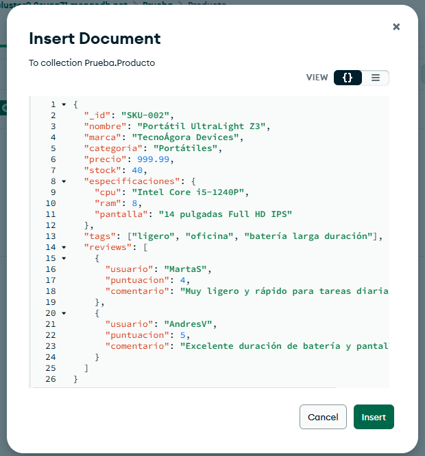
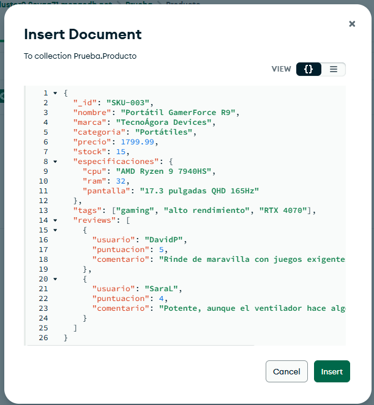

# Crear 2 documentos adicionales

# Ejercicio 1

db.Producto.find({categoria: "Portátiles",
                 marca: "TecnoÁgora Devices",
                 "especificaciones.ram": {$gt: 8}})

# Ejercicio 2

db.Producto.find({tags: "oferta"})

# Ejercicio 3

db.productos.updateOne(
  { nombre: "Portátil Pro-Book X1" },  
  { $inc: { stock: 10 } }              
)

# Ejercicio 4

db.productos.updateOne(
  { nombre: "Portátil Pro-Book X1" },
  {
    $push: {
      reseñas: {
        usuario: "Alejandro Galera Rico",
        puntuacion: 5,
        comentario: "Excelente rendimiento y diseño muy elegante."
      }
    }
  }
)

# Parte 3

db.productos.aggregate([
  {
    $unwind: "$reseñas"
  },
  {
    $group: {
      _id: "$nombre",              
      puntuacion_media: { $avg: "$reseñas.puntuacion" } 
    }
  },
  {
    $sort: { puntuacion_media: -1 } 
  }
])