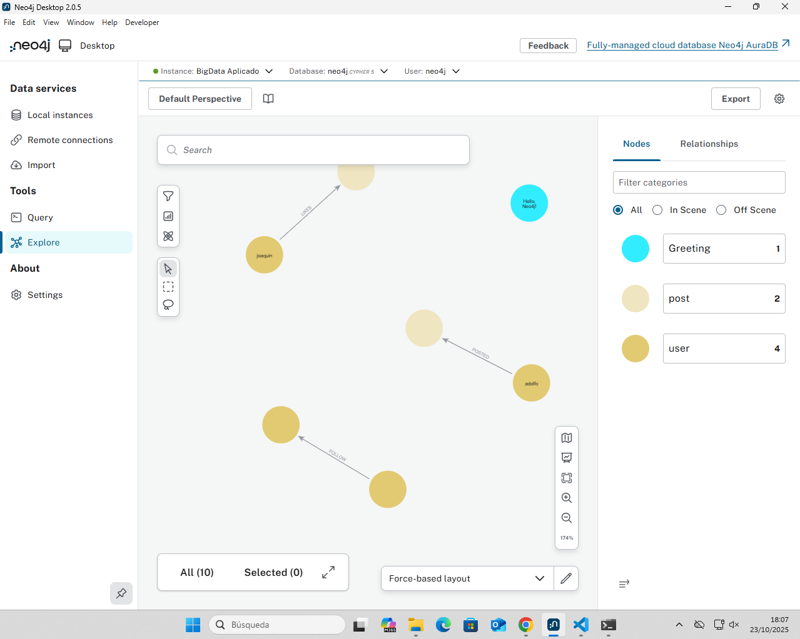
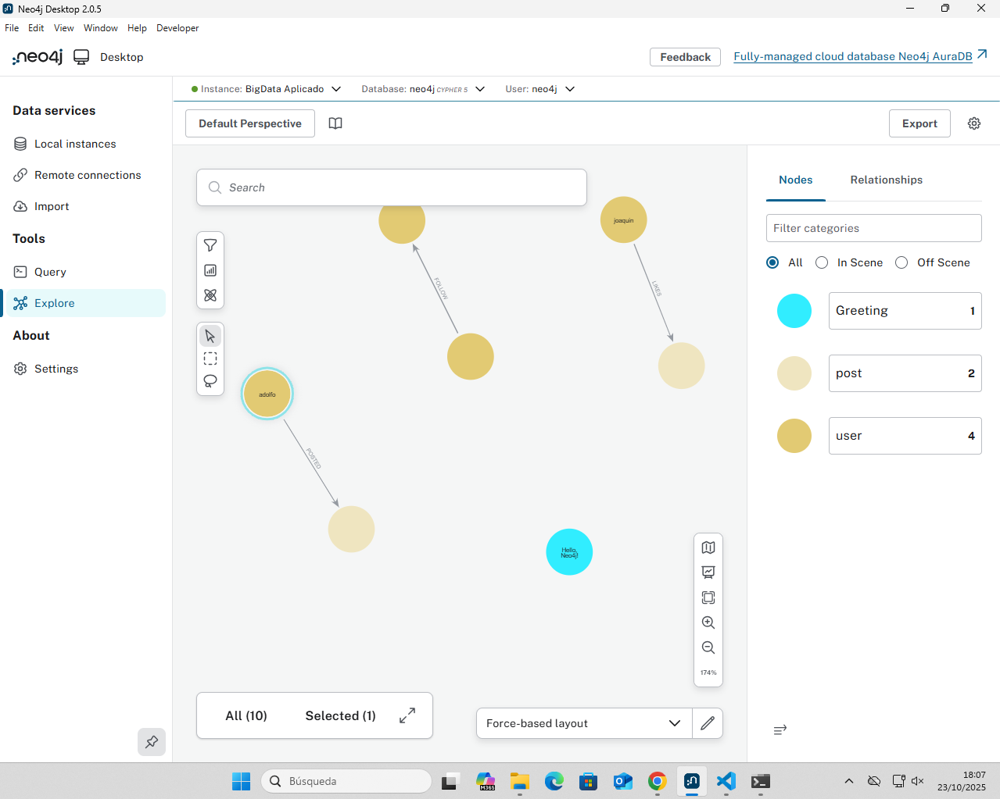
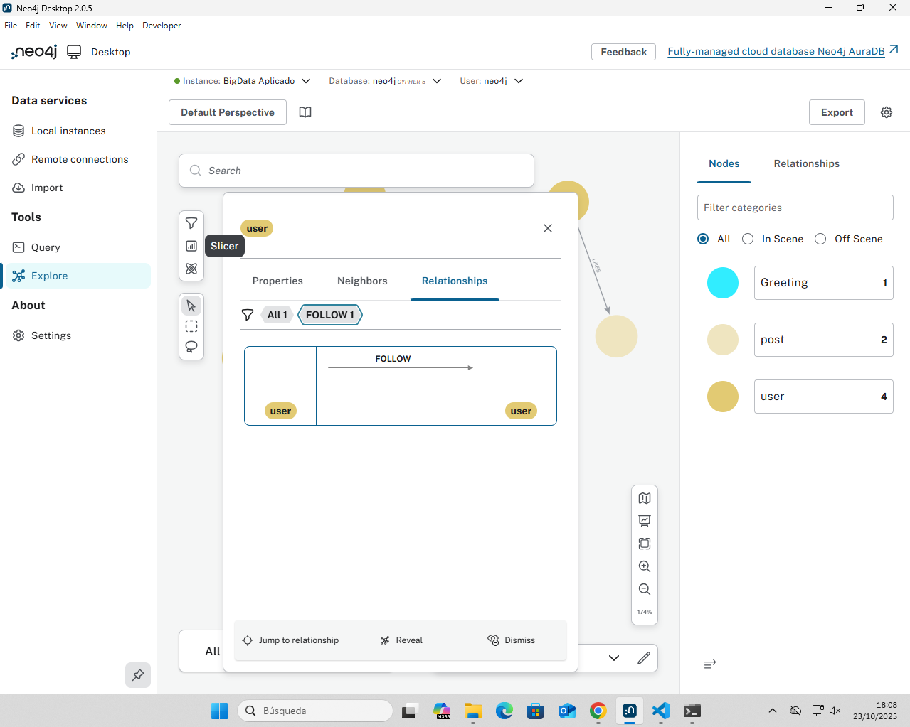
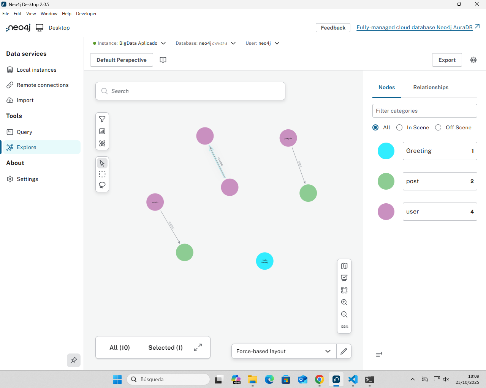

# Ejercicio 1

## Nodos
CREATE (:use{username:"alee00_00", name:"Alejandro Galera",registrarion_date:"20/01/2005"})

CREATE (:use{username:"antoniomenor02", name:"Antonio Menor", registrarion_date:"20/11/2005"})

CREATE (:post {content:"pequeñito", timestamp:"1:01:50"})

CREATE (:post {content:"chikitito", timestamp:"12:14:27"})

## Relaciones

CREATE (a:user)-[:FOLLOW]->(b:user)

CREATE (a:user {name:"adolfo", username:"adolfito_Chikitito", registrarion_date:"20/09/2006"})-[:POSTED]->(b:post {message:"muchachos", timestamp:"20:09:56"})

CREATE (a:user {name:"joaquin", username:"joao_del_mar", registrarion_date:"10/12/2012"})-[:LIKES]->(b:post {message:"pokemon", timestamp:"14:45:36"})

# Ejercicio 2

## Crear Nodos
CREATE (a:user {name:"jorge", username:"jorgito_calavera", registrarion_date:"05/03/2014"})

CREATE (a:user {name:"pepito", username:"pepito_grillo", registrarion_date:"09/04/2002"})

CREATE (a:user {name:"jose", username:"jose_pro", registrarion_date:"08/07/2022"})

## Crear Relaciones
### Follow

CREATE (u1:user {name:"marta", username:"marta_cool", registration_date:"15/03/2015"})-[:FOLLOW]->(u2:user {name:"pablo", username:"pablin_90", registration_date:"07/08/2010"})

CREATE (u1:user {name:"sofia", username:"sofii_star", registration_date:"23/11/2018"})-[:FOLLOW]->(u2:user {name:"diego", username:"dieguito_21", registration_date:"02/04/2014"})

CREATE (u1:user {name:"lucas", username:"luk_rock", registration_date:"01/01/2020"})-[:FOLLOW]->(u2:user {name:"carla", username:"carli_smile", registration_date:"18/09/2016"})

### Post

CREATE (p1:post {message:"mañana empiezo el gimnasio", timestamp:"10:10:10"})

CREATE (p2:post {message:"escuchando mi playlist favorita", timestamp:"23:59:59"})

### Posted

CREATE (a:user {name:"valeria", username:"valy_art", registrarion_date:"03/05/2020"})-[:POSTED]->(b:post {message:"nuevo dibujo terminado 🎨", timestamp:"14:28:45"})

CREATE (a:user {name:"daniel", username:"daniel_coder", registrarion_date:"22/01/2023"})-[:POSTED]->(b:post {message:"probando mi primer API en Python!", timestamp:"19:11:33"})

### Likes

CREATE (a:user {name:"laura", username:"lauri_sky", registrarion_date:"12/02/2018"})-[:LIKES]->(b:post {message:"viaje a París", timestamp:"08:24:51"})

CREATE (a:user {name:"andres", username:"andresito_dev", registrarion_date:"30/06/2021"})-[:LIKES]->(b:post {message:"probando nuevo lenguaje", timestamp:"16:42:09"})

# Ejercicio 3

## Encontrar todos los usuarios que un usuario específico sigue

MATCH (p:user {name:"pablo"})-[:FOLLOW]->(s:user )
RETURN s.name AS nombre, s.username AS usuario;

## Encontrar todos los usuarios que siguen a un usuario específico

MATCH (s:user)-[:FOLLOW]->(p:user {name:"pablo"})
RETURN s.name AS nombre, s.username AS usuario;

# Ejercicio 4

## Encontrar todos los posts de un usuario específico

MATCH (p:user {name:"valeria"})-[:POSTED]->(s:post )
RETURN s.name AS nombre, s.timestamp AS hora_publicacion;

## Encontrar los posts que un usuario ha dado “Like”

MATCH (p:user {name:"laura"})-[:LIKES]->(s:post )
RETURN s.name AS nombre, s.timestamp AS hora_publicacion;

# Ejercicio 5

