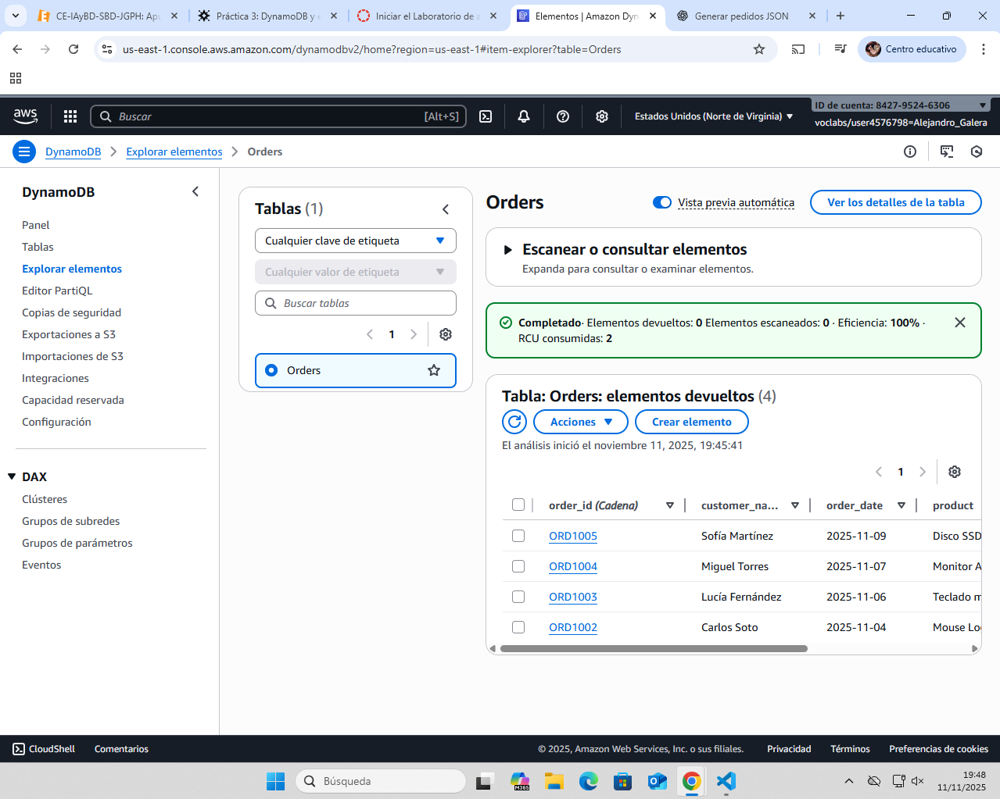
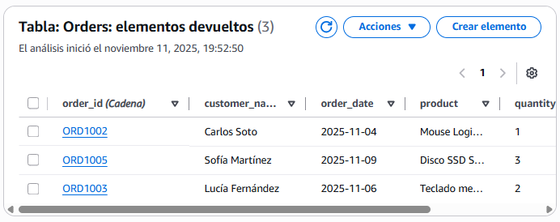

# Ejercicio 1

# Ejercicio 2 

{
  "order_id": { "S": "ORD1003" },
  "customer_name": { "S": "Lucía Fernández" },
  "product": { "S": "Teclado mecánico Redragon" },
  "quantity": { "N": "2" },
  "order_date": { "S": "2025-11-06" },
  "status": { "S": "Pending" }
},
{
  "order_id": { "S": "ORD1004" },
  "customer_name": { "S": "Miguel Torres" },
  "product": { "S": "Monitor ASUS 27\"" },
  "quantity": { "N": "1" },
  "order_date": { "S": "2025-11-07" },
  "status": { "S": "Delivered" }
},
{
  "order_id": { "S": "ORD1005" },
  "customer_name": { "S": "Sofía Martínez" },
  "product": { "S": "Disco SSD Samsung 1TB" },
  "quantity": { "N": "3" },
  "order_date": { "S": "2025-11-09" },
  "status": { "S": "Shipped" }
}

# Ejercicio 3 

# Ejercicio 4

# Reflexion Final 

## Comparativa: ¿Qué diferencias clave notaste entre trabajar con DynamoDB y lo que has visto de MongoDB? (Piensa en la sintaxis de inserción, las consultas, el esquema…).

En dynamoDB tanto agregar, eliminar o editar elementos es mucho mas sencillo ya que se puede hacer todo el mediante un editor visual y no se basa en query

## Ventajas Serverless: ¿Qué beneficios crees que aporta un servicio como DynamoDB a un equipo de desarrollo? ¿Y qué inconvenientes podría tener?

Las ventajas serian que no necesitaria mantenimiento, existe una escalabilidad automatica y una buena tolerancia a fallos

Las desventajas serian las limitaciones en las consultas o la dependencia del proovedor

## Experiencia: ¿Qué te resultó más fácil de esta práctica? ¿Qué fue lo más complicado o confuso?

Me ha resultado mucho mas facil el controlar DynamoDB al editar o crear objetos pero me resulta mucho mas dificil el llegar a la propia pagina de la base de datos y empezar a desarrollar la base de datos