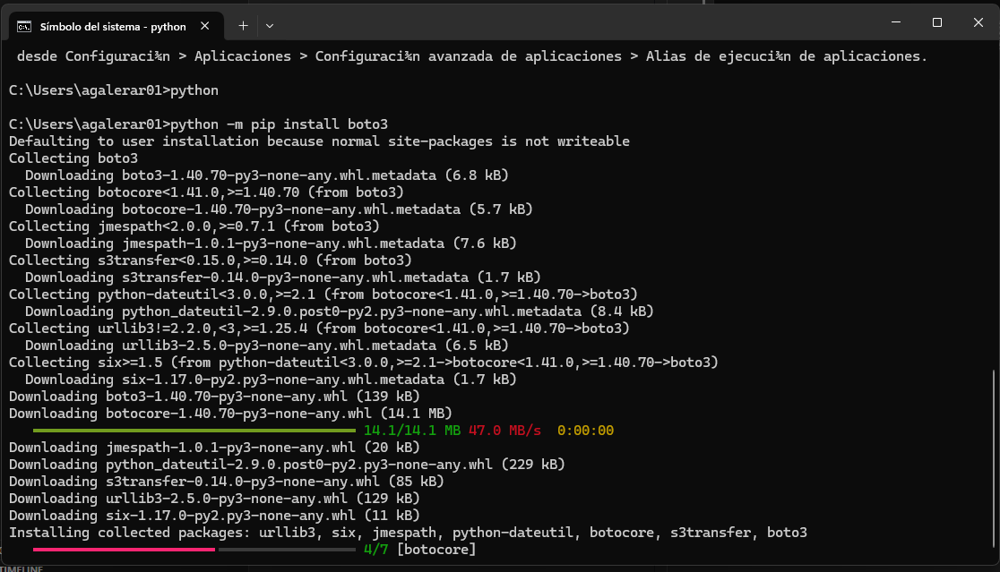
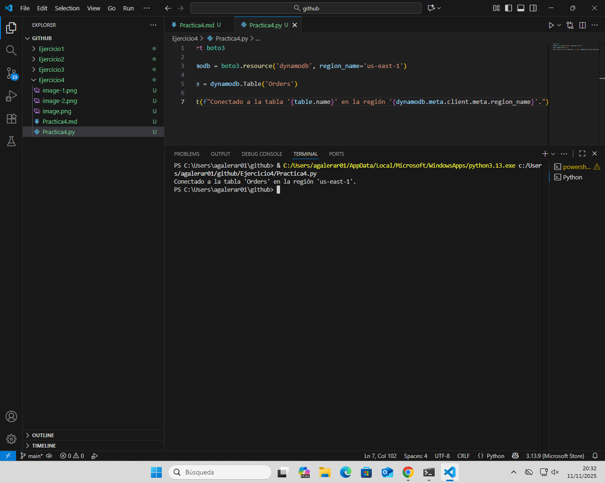
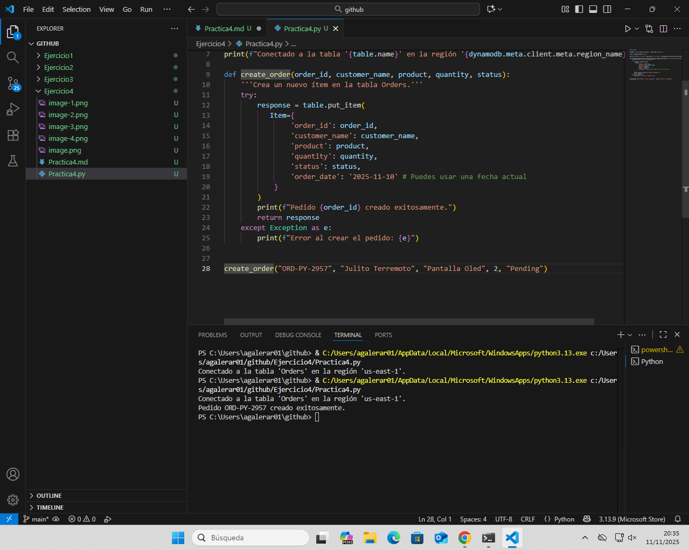
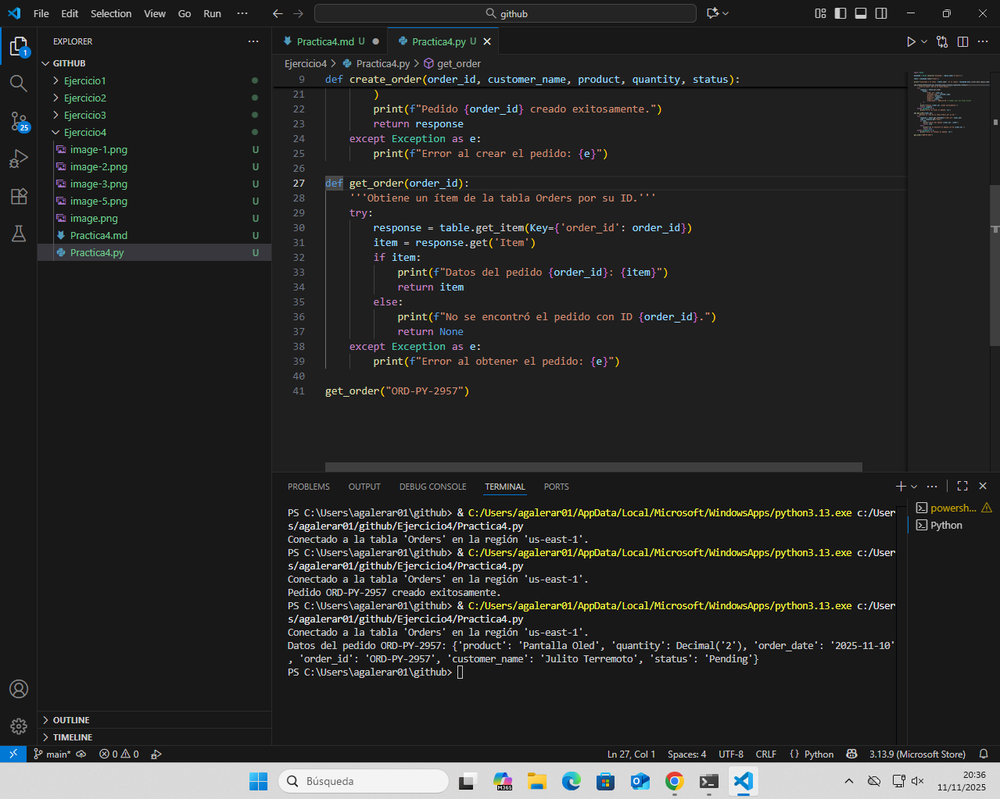
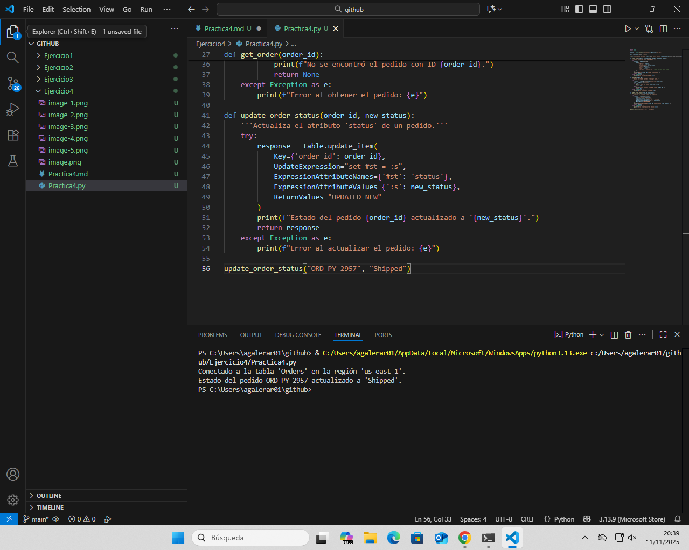

# Parte 1

## 1.1 Instalacion de Boto 3




## 1.2 Verificación de las Credenciales


# Parte 2: Automatizando Operaciones con Boto3

## 2.1. Conexión a DynamoDB



```bash
dynamodb = boto3.resource('dynamodb', region_name='us-east-1')

table = dynamodb.Table('Orders')

print(f"Conectado a la tabla '{table.name}' en la región '{dynamodb.meta.client.meta.region_name}'.")
```

Aquí estamos conectando nuestro script de Python con la base de datos DynamoDB en AWS.

boto3.resource('dynamodb') sirve para acceder al servicio DynamoDB.

region_name='us-east-1' indica la región donde está nuestra base de datos.

dynamodb.Table('Orders') selecciona la tabla llamada Orders.

# Ejercicio 1 



```bash
def create_order(order_id, customer_name, product, quantity, status):
    '''Crea un nuevo ítem en la tabla Orders.'''
    try:
        response = table.put_item(
           Item={
                'order_id': order_id,
                'customer_name': customer_name,
                'product': product,
                'quantity': quantity,
                'status': status,
                'order_date': '2025-11-10' # Puedes usar una fecha actual
            }
        )
        print(f"Pedido {order_id} creado exitosamente.")
        return response
    except Exception as e:
        print(f"Error al crear el pedido: {e}")
```

Esta función crea un nuevo pedido dentro de la tabla.

put_item() inserta los datos (como el ID del pedido, nombre del cliente, producto, etc.).

Si todo sale bien, muestra un mensaje diciendo que el pedido se creó.

Si hay un error, lo muestra por pantalla.

# Ejercicio 2



```bash
def get_order(order_id):
    '''Obtiene un ítem de la tabla Orders por su ID.'''
    try:
        response = table.get_item(Key={'order_id': order_id})
        item = response.get('Item')
        if item:
            print(f"Datos del pedido {order_id}: {item}")
            return item
        else:
            print(f"No se encontró el pedido con ID {order_id}.")
            return None
    except Exception as e:
        print(f"Error al obtener el pedido: {e}")
```

Esta función busca un pedido usando su ID.

get_item() busca en la tabla el pedido con el ID que le pasamos.

Si lo encuentra, lo muestra en pantalla.

Si no existe, muestra un mensaje de que no se encontró.

# Ejercicio 3



```bash
def update_order_status(order_id, new_status):
    '''Actualiza el atributo 'status' de un pedido.'''
    try:
        response = table.update_item(
            Key={'order_id': order_id},
            UpdateExpression="set #st = :s",
            ExpressionAttributeNames={'#st': 'status'},
            ExpressionAttributeValues={':s': new_status},
            ReturnValues="UPDATED_NEW"
        )
        print(f"Estado del pedido {order_id} actualizado a '{new_status}'.")
        return response
    except Exception as e:
        print(f"Error al actualizar el pedido: {e}")
```

Esta función cambia el estado del pedido (por ejemplo, de "Pending" a "Shipped").

update_item() permite modificar un dato en un registro.

UpdateExpression indica qué campo cambiar.

Se enseña un mensaje indicando el nuevo estado.

# Ejercicio 4


```bash
def delete_order(order_id):
    '''Elimina un item de la tabla Orders.'''
    try:
        response = table.delete_item(Key={'order_id': order_id})
        print(f"Pedido {order_id} eliminado exitosamente.")
        return response
    except Exception as e:
        print(f"Error al eliminar el pedido: {e}")
```

Esta función borra un pedido de la tabla usando su ID.

delete_item() elimina el registro indicado.

Si todo va bien, muestra un mensaje diciendo que se borró.

# Ejercicio 5 


```bash
def get_order_by_customer(customer_name):
    """Obtiene un pedido de la tabla Orders por el nombre del cliente."""
    try:
        # Buscar pedidos cuyo atributo 'customer_name' coincida con el nombre dado
        response = table.scan(
            FilterExpression=Attr('customer_name').eq(customer_name)
        )
        
        items = response.get('Items', [])
        
        if items:
            print(f"Pedidos encontrados para {customer_name}: {items}")
            return items  # Puede haber más de un pedido con el mismo nombre
        else:
            print(f"No se encontró ningún pedido con el nombre de cliente '{customer_name}'.")
            return None

    except Exception as e:
        print(f"Error al obtener el pedido: {e}")
        return None
    except Exception as e:
        print(f"Error al obtener el pedido: {e}")
```

Esta función busca todos los pedidos de un cliente por su nombre.

scan() recorre toda la tabla y filtra los registros que coinciden con el nombre del cliente.

Muestra todos los pedidos encontrados o un mensaje si no hay ninguno.

# Parte 3


```bash
if __name__ == "__main__":
    print("--- Demostración de operaciones con DynamoDB ---")

    # 1. Crear un nuevo pedido
    create_order("ORD-PY-1001", "Ana García", "Teclado Mecánico", 1, "Pending")

    # 2. Leer el pedido recién creado
    get_order("ORD-PY-1001")

    # 3. Actualizar su estado
    update_order_status("ORD-PY-1001", "Shipped")
    get_order("ORD-PY-1001") # Verificamos el cambio

    # 4. Buscar todos los pedidos de un cliente (usa un nombre que exista en tu tabla)
    get_order_by_customer("Ana García")
    get_order_by_customer("Carlos Soto") # Ejemplo con otro cliente

    # 5. Eliminar el pedido
    delete_order("ORD-PY-1001")
    get_order("ORD-PY-1001") # Verificamos que ya no existe

    print("\n--- Demostración finalizada ---")
```

# Conclusion Final

## 1.Automatización vs. Consola: ¿Qué ventajas claras observas al usar un script de Python en lugar de la consola web de AWS para gestionar los datos? ¿Y qué desventajas?

Las desventajas es la syntaxis ya que necesitas aprendertela pero en la consola todo es mucho mas sencilla mediante la interfaz grafica

Las ventajas serian la posibilidad de automatizacion del proceso y el poder procesar muchas peticiones a la vez

## 2.SDK como Herramienta: ¿En qué otros escenarios (además de gestionar pedidos) podrías imaginar el uso de Boto3 para automatizar tareas en AWS?

Las infraestructutas, almacenamiento o machine learning entre otros

## 3.Dificultades y Aprendizajes: ¿Qué parte de la práctica te resultó más desafiante? ¿Cuál fue el concepto más interesante que aprendiste?

Lo mas desafiante fue la parte de get_order_by_customername porque al no saber bien la syntaxis tuve que hacer alguna busqueda por mi cuenta para utilizar el metodo scan()

Y el concepto mas interesante que aprendi fue la automatizacion de procesos 