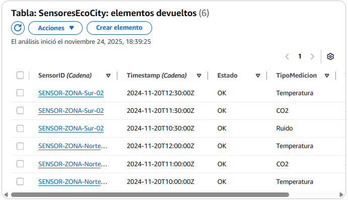
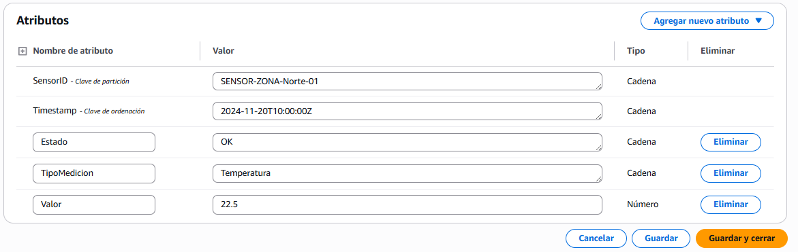
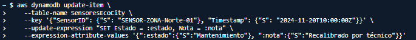
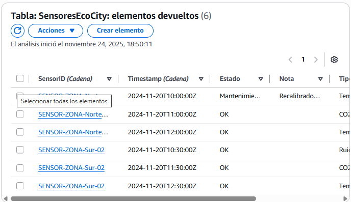
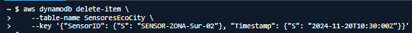

# 1. Diseño y Creación de la Tabla

Partition Key: SensorID
Sort Key: Timestamp

# 2. Ingesta de Datos (Create)

Voy a insertar 2 sensores distintos que tengan 3 mediciones cada uno

# 3. Consulta de Datos

Vamos a ver como evoluciona el sensor de temperatura de la zona Norte 01

Con la linea --scan-index-forward hace que se ordene de la mas reciente a la mas antigua

# 4. Actualización de Datos

Los datos antes de hacer el update 

El codigo utilizado en CLI

Los datos una vez hecho el update

# 5. Eliminación de Datos

La tabla antes de hacer el detele

El codigo utilizado en CLI

La tabla despues de hacer el delete

# Conclusion

Es util para los datos de los sensores ya que puede almacenar mucha informacion sin realentizarse.
Se pueden consultar facil y rapido los datos y podemos crear un indice especial para hacer busquedas concretas. Es una buena herramienta para trabajar con proyectos de IoT