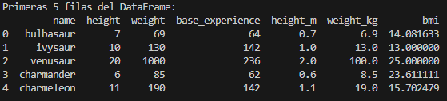

# Práctica 2 – Extracción y Transformación de Datos desde una API

## Descripción de la práctica

En esta práctica se ha desarrollado un script en Python que se conecta a la **PokéAPI** para extraer información de todos los Pokémon disponibles.  
El objetivo es aprender a trabajar con **APIs paginadas**, realizar peticiones múltiples, transformar los datos obtenidos y almacenarlos en un formato estructurado listo para su análisis.

Durante el proceso se han aplicado conceptos de **ETL (Extracción, Transformación y Carga)** utilizando las librerías `requests` y `pandas`.

---

## Evidencias de la Invocación

### Código del bucle `while` para la paginación

```python
while url:
    response = requests.get(url)
    data = response.json()

    for pokemon in data["results"]:
        detalle_response = requests.get(pokemon["url"])
        detalle = detalle_response.json()

        info = {
            "name": detalle["name"],
            "height": detalle["height"],
            "weight": detalle["weight"],
            "base_experience": detalle["base_experience"]
        }

        pokemon_detalles.append(info)

        print(
            f"Pokémon cargado → "
            f"Nombre: {info['name']} | "
            f"Altura: {info['height']} | "
            f"Peso: {info['weight']} | "
            f"Experiencia base: {info['base_experience']}"
        )

        time.sleep(0.2)

    url = data["next"]
    time.sleep(0.5)
```
# Progreso de las consultas


# Calculo BMI

```bash
df["height_m"] = df["height"] / 10
df["weight_kg"] = df["weight"] / 10
df["bmi"] = df["weight_kg"] / (df["height_m"] ** 2)
```
# df.head()



# Preguntas de Reflexión
1. ¿Por qué es importante actualizar la URL con el enlace next en lugar de incrementar un número de página manualmente?

Porque no todas las APIs utilizan un sistema de paginación numérico. Usar el enlace next asegura que sigue las reglas de la API y evita errores.

2. ¿Qué ventaja tiene normalizar las unidades dentro del propio proceso ETL en lugar de hacerlo después en una hoja de cálculo?

Permite automatizar el proceso, evitar errores manuales y garantizar que todos los datos están en el mismo formato desde el principio.

3. Si la API tuviera un límite de 1000 registros por página, ¿cómo afectaría esto al rendimiento del script?

El script sería más rápido porque se reduciría el número de peticiones necesarias. Sin embargo, cada respuesta sería más pesada.

# Conclusión

Automatizar la extracción de datos desde APIs externas permite trabajar con información actualizada. Esto ahorra tiempo, reduce errores y facilita la integración de los datos . Además, el uso de scripts automatizados hace que el proceso sea escalable y reutilizable.