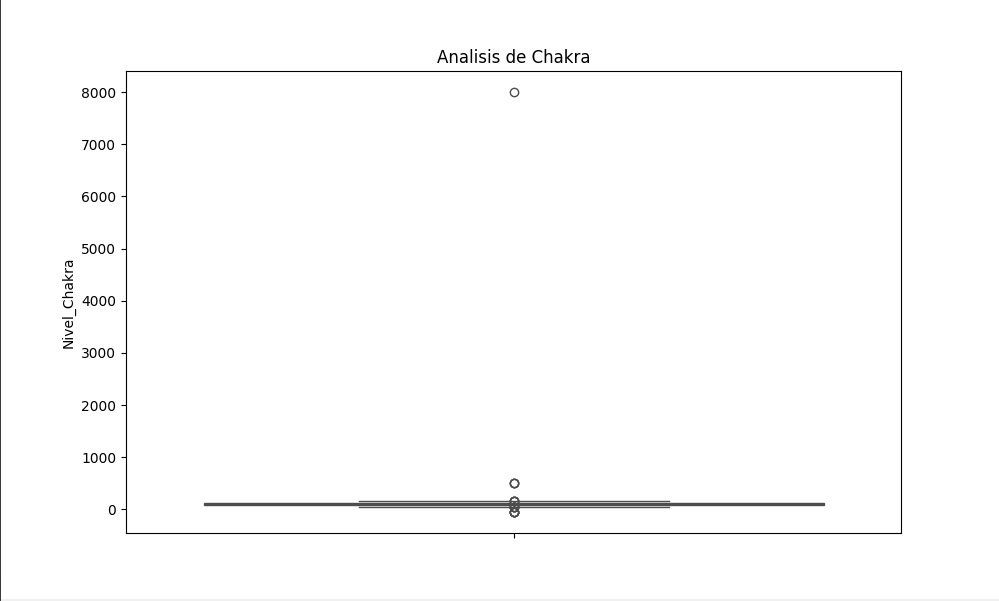
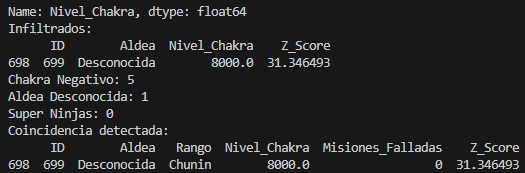

Aquí tienes el contenido estructurado para tu documento **Practica02_ApellidoNombre.md**. Puedes copiarlo directamente, solo recuerda sustituir "ApellidoNombre" por tus datos y adjuntar las capturas de pantalla de los gráficos que generes al ejecutar el código.

---

# Informe de Misión: Detección de Infiltrados

## 1. Código Python Utilizado

```python
import pandas as pd
import seaborn as sns
import matplotlib.pyplot as plt

# 1
df = pd.read_csv('misiones_limpias.csv')
stats = df['Nivel_Chakra'].describe()
print("Estadísticas de la columna Chakra:")
print(stats)

media_chakra = stats['mean']
std_chakra = stats['std']

# 2

plt.figure(figsize=(10, 6))
sns.boxplot(y=df['Nivel_Chakra'], color='orange')
plt.title('Analisis de Chakra')
plt.show()

# 3
df['Z_Score'] = (df['Nivel_Chakra'] - media_chakra) / std_chakra
infiltrados = df[df['Z_Score'].abs() > 3]

# 4
chakra_negativo = df[df['Nivel_Chakra'] < 0]
aldea_desconocida = df[df['Aldea'].str.lower() == 'desconocida']
super_ninjas = df[(df['Z_Score'].abs() > 2) & (df['Z_Score'].abs() <= 3)]

# 5
print("\nInfiltrados Detectados:")
print(infiltrados[['ID', 'Aldea', 'Nivel_Chakra', 'Z_Score']].head())

print(f"\nResumen de anomalías:")
print(f"- Chakra Negativo: {len(chakra_negativo)}")
print(f"- Aldea Desconocida: {len(aldea_desconocida)}")
print(f"- Super Ninjas: {len(super_ninjas)}")

if not infiltrados.empty and not aldea_desconocida.empty:
    coincidencia = infiltrados[infiltrados['ID'].isin(aldea_desconocida['ID'])]
    if not coincidencia.empty:
        print("\nCoincidencia detectada entre Infiltrado y Aldea Desconocida:")
        print(coincidencia.head())

```

---

## 2. Evidencias Gráficas y Dataframes

### Perfil del Ninja Promedio (.describe)

* **Media de chakra:** 108.93
* **Desviación estándar:** 251.74
* **Valor máximo sospechoso:** 8000.0 (Se aleja drásticamente de la media).

### Visualización de Outliers (Boxplot)



### Registros de Sospechosos (.head)




## 3. Reflexión Final

* **¿Por qué un outlier puede ser un error del sensor y no necesariamente un ataque?**
En el dataset se observan valores de **-50.0** en el nivel de chakra. Dado que el chakra es una energía vital que no puede ser negativa, estos valores representan un error técnico en el equipo de medición o sensor.
* **Si eliminas los outliers, ¿cómo cambia la media del dataset?**
La media **baja**. Al eliminar el valor extremo de 8000.0 (infiltrado), que está muy por encima del resto, el promedio desciende de 108.93 a aproximadamente 101.03, representando mejor al grupo normal.
* **¿Sería justo castigar a los “Super Ninjas” (Z-Score > 2 pero < 3) solo por ser fuertes?**
**No es justo.** Desde un punto de vista estadístico, un Z-Score entre 2 y 3 indica que el individuo es excepcional pero todavía forma parte de la distribución normal de la población (el 2.1% superior). No hay evidencia matemática de que sean una anomalía o una amenaza, sino simplemente ninjas de élite.
