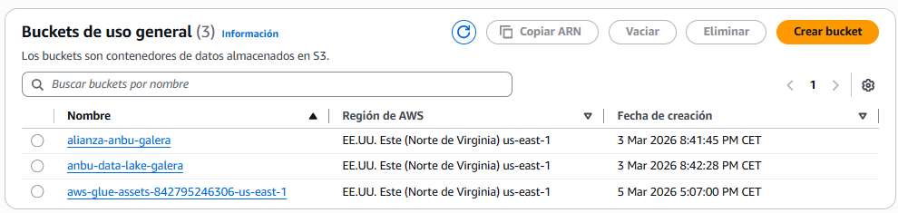
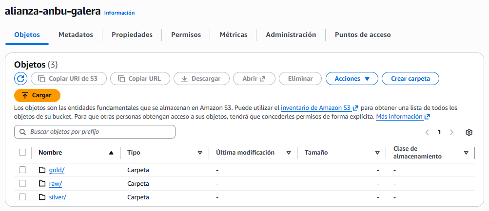
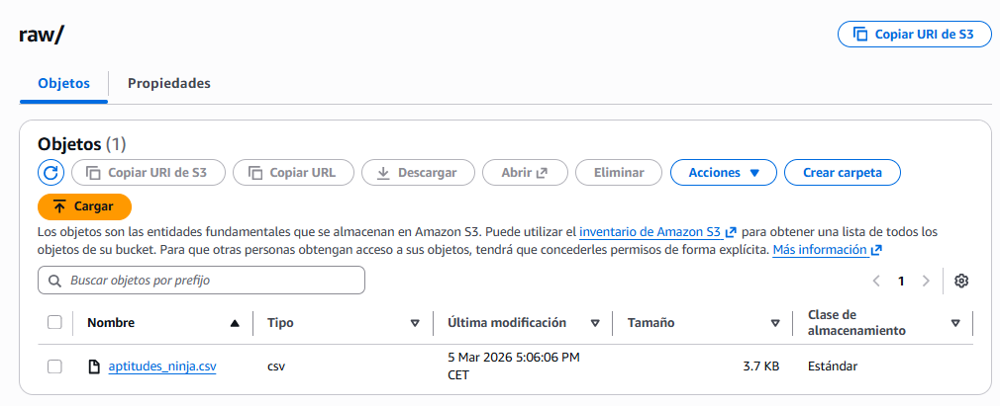
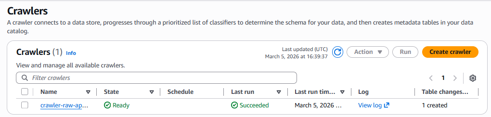
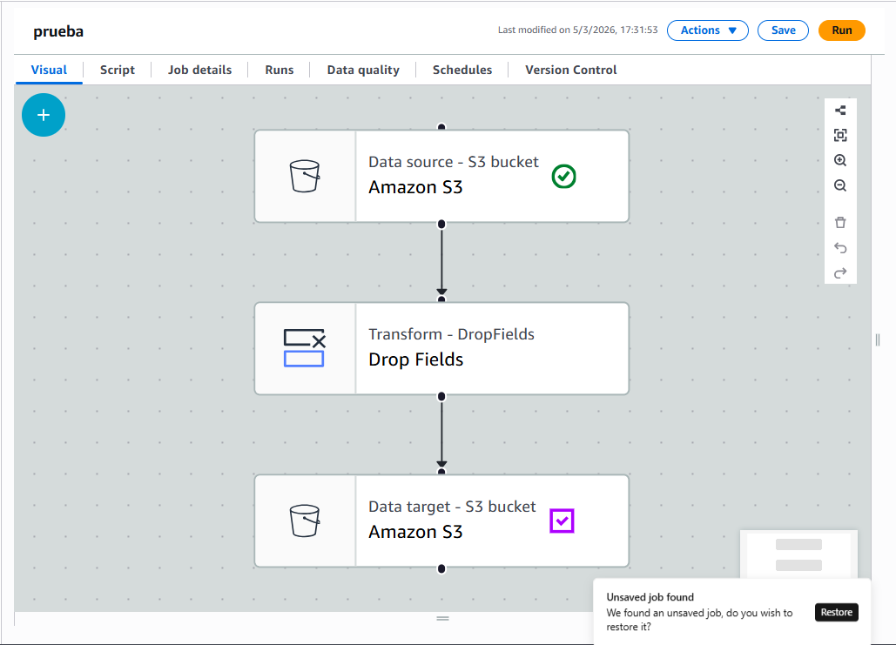
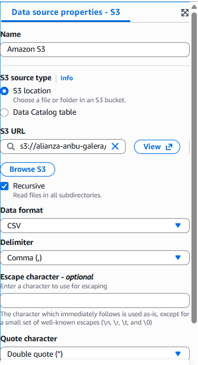
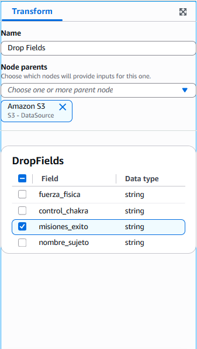
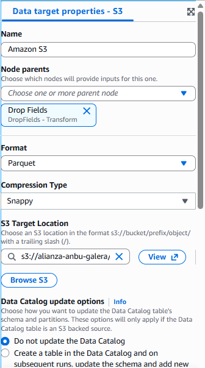
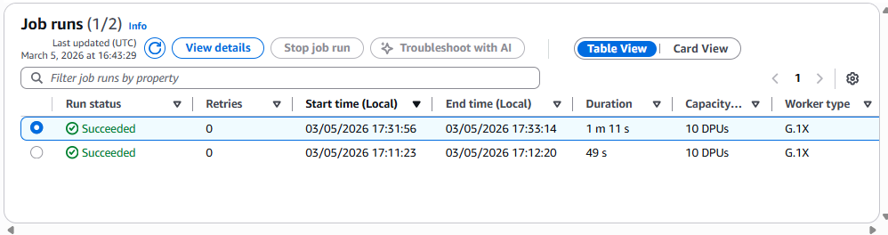
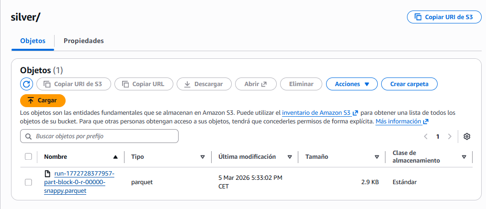

# Práctica 1. El Purificador de Pergaminos (ETL)

## 1.Crea un Bucket en S3

## 2.Organiza las carpetas

## 3.Sube los datos

# Entrega

## 1.Configuración del Crawler

## 2.Diseño del Job (ETL)

 ### 2.1.Source
 

 ### 2.2.Transformación
 

 ### 2.3.Target
 

## 3.Ejecución y Monitoreo

## 4.Verificación de Resultados

# Tabla comparativa 

| Archivo                                   | Formato  | Tamaño |
|--------------------------------------------|----------|--------|
| aptitudes_ninja.csv                       | CSV      | 3.7 KB |
| run-1772728377957-part-block-0-r-00000-snappy.parquet | Parquet  | 2.9 KB |

# Reflexion

El enfoque serverless es más escalable, automatizable y robusto que ejecutar scripts manualmente en un ordenador personal, especialmente cuando se trabaja con pipelines de datos y grandes volúmenes de información.