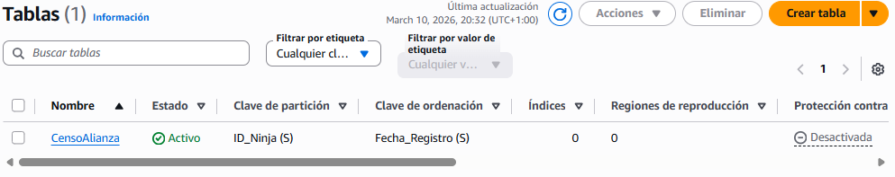
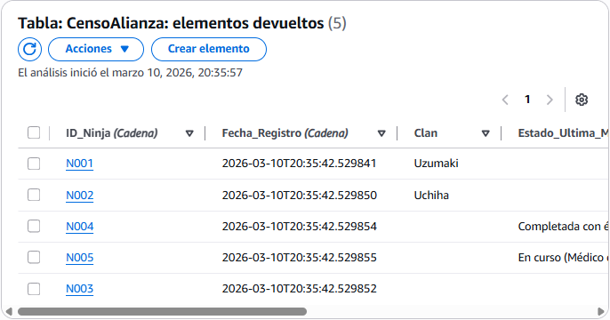
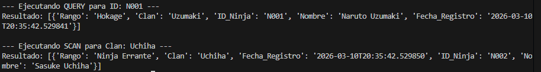
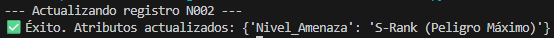
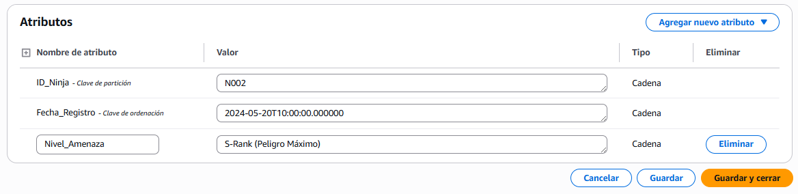

# El Índice de las Sombras (NoSQL)

## 1.Creación de la Tabla Principal



Partition Key: ID_Ninja (String).
Sort Key : Fecha_Registro.

## 2.ingesta de datos



```bash
ninjas = [
    # Ninja A: Nombre, Clan, Rango
    {
        'ID_Ninja': 'N001',
        'Fecha_Registro': datetime.now().isoformat(),
        'Nombre': 'Naruto Uzumaki',
        'Clan': 'Uzumaki',
        'Rango': 'Hokage'
    },
    {
        'ID_Ninja': 'N002',
        'Fecha_Registro': datetime.now().isoformat(),
        'Nombre': 'Sasuke Uchiha',
        'Clan': 'Uchiha',
        'Rango': 'Ninja Errante'
    },
    # Ninja B: Nombre, Habilidades_Especiales (Array), Herramientas (JSON/Map)
    {
        'ID_Ninja': 'N003',
        'Fecha_Registro': datetime.now().isoformat(),
        'Nombre': 'Kakashi Hatake',
        'Habilidades_Especiales': ['Chidori', 'Sharingan', 'Kamui'],
        'Herramientas': {
            'Principal': 'Kunai de espacio-tiempo',
            'Secundaria': 'Libro Icha Icha'
        }
    },
    # Ninja C: Nombre, Estado_Ultima_Mision
    {
        'ID_Ninja': 'N004',
        'Fecha_Registro': datetime.now().isoformat(),
        'Nombre': 'Shikamaru Nara',
        'Estado_Ultima_Mision': 'Completada con éxito'
    },
    {
        'ID_Ninja': 'N005',
        'Fecha_Registro': datetime.now().isoformat(),
        'Nombre': 'Sakura Haruno',
        'Estado_Ultima_Mision': 'En curso (Médico de apoyo)'
    }
]
```

## 3.Simulación de Búsqueda ANBU



### ¿Por qué el Scan es más lento y costoso?

La Query es como usar un índice: DynamoDB sabe exactamente en qué partición física están guardados esos datos. La velocidad es constante (milisegundos) sin importar si tienes 10 o 10 millones de registros.

En el Scan DynamoDB no sabe dónde están esos ninjas. Tiene que leer cada registro de la tabla, de principio a fin, y descartar los que no coincidan.

```bash
# --- 1. QUERY (Buscando por ID_Ninja específico) ---
def ejecutar_query(id_ninja):
    print(f"\n--- Ejecutando QUERY para ID: {id_ninja} ---")
    inicio = time.perf_counter()
    
    # La Query requiere la Clave de Partición
    respuesta = table.query(
        KeyConditionExpression=Key('ID_Ninja').eq(id_ninja)
    )
    
    fin = time.perf_counter()
    print(f"Resultado: {respuesta['Items']}")

# --- 2. SCAN (Buscando por Clan - Atributo que no es clave) ---
def ejecutar_scan(clan):
    print(f"\n--- Ejecutando SCAN para Clan: {clan} ---")
    inicio = time.perf_counter()
    
    # El Scan revisa TODA la tabla y luego filtra
    respuesta = table.scan(
        FilterExpression=Attr('Clan').eq(clan)
    )
    
    fin = time.perf_counter()
    print(f"Resultado: {respuesta['Items']}")
```

## 4.Actualización Dinámica





```bash
def actualizar_ninja_dinamicamente(id_ninja, fecha_registro, nivel):
    print(f"--- Actualizando registro {id_ninja} ---")
    
    try:
        respuesta = table.update_item(
            Key={
                'ID_Ninja': id_ninja,
                'Fecha_Registro': fecha_registro
            },
            # SET crea el atributo si no existe o lo actualiza si ya existe
            UpdateExpression="SET Nivel_Amenaza = :val",
            ExpressionAttributeValues={
                ':val': nivel
            },
            ReturnValues="UPDATED_NEW" # Nos devuelve solo lo que cambió
        )
        print(f"✅ Éxito. Atributos actualizados: {respuesta['Attributes']}")
    except Exception as e:
        print(f"❌ Error al actualizar: {e}")
```